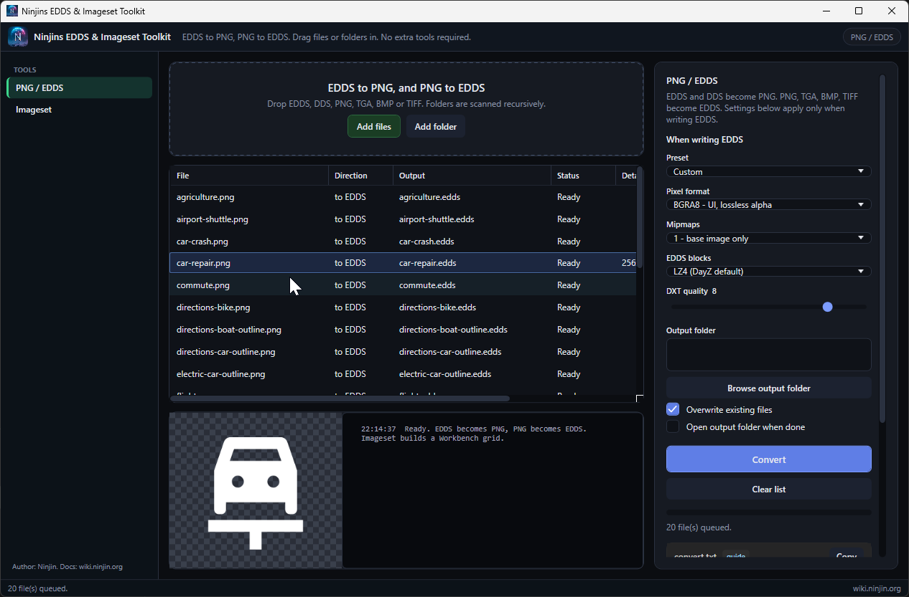
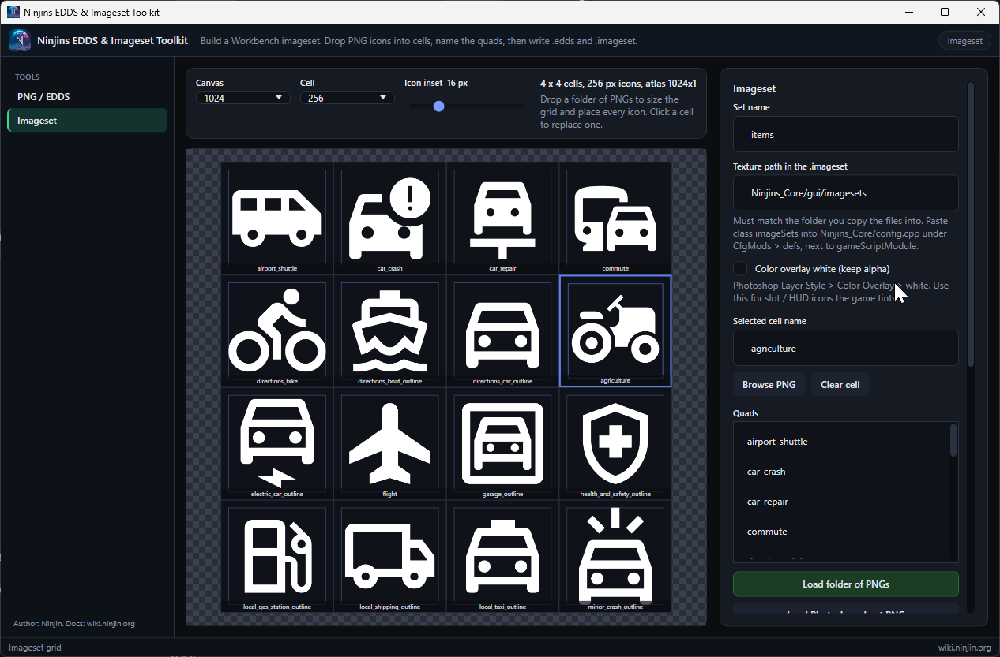
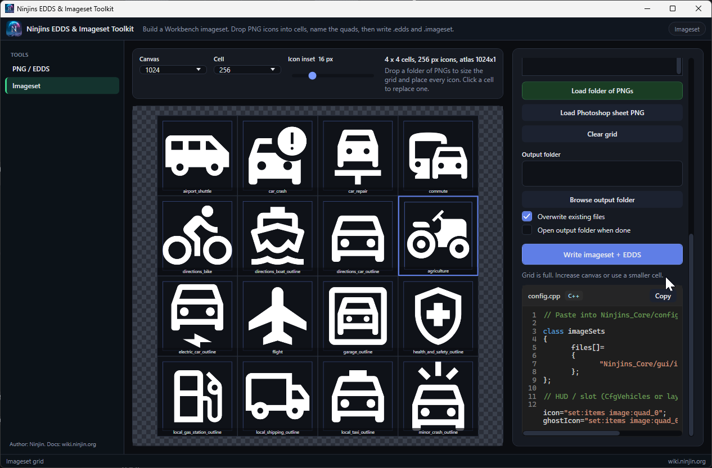

# Ninjins EDDS & Imageset Toolkit (beta)

**Beta.** Expect rough edges. Open an issue if something breaks.

Windows GUI for DayZ / Enfusion textures. **PNG / EDDS** converts both ways (EDDS to PNG, PNG to EDDS) without Workbench, Go, or Python. **Imageset** builds a visual icon grid for Workbench.

Drop files or a whole folder in, pick a preset, click Convert. **Bulk convert** is supported: folders are scanned recursively, then every matching file is converted in one go. A published build is a single `.exe`.

## Video


Same clip on [YouTube](https://www.youtube.com/watch?v=HSkTyXyX2hk).

## Screenshots

<p align="center">
  
</p>
<p align="center">
  
  
</p>

## What it does

- Reads Enfusion EDDS: DDS header, `ENF1` mark, `COPY` / `LZ4 ` block table (smallest mip first), 64 KiB LZ4 chunk-stream
- Writes the same container so DayZ can load the file
- PNG, TGA, BMP, TIFF, JPEG in; PNG or EDDS out
- Bulk convert: drop many files, or a folder (recursive), convert them all at once
- DDS in (standard DirectDraw, converted to PNG)
- ImageSet tab: visual canvas, drop icons into cells, optional white overlay, write `.edds` + `.imageset`

Pixel formats when writing EDDS:

| Preset | Format | Mips | Use |
| --- | --- | --- | --- |
| UI / icons | BGRA8 | 1 | HUD, icons, lossless alpha |
| Opaque texture | DXT1 | full chain | Albedo without alpha |
| Transparent texture | DXT5 | full chain | Soft alpha, smaller than BGRA8 |

## Imageset (Workbench / Photoshop flow)

A square canvas, a grid, named quads, then both files in the mod.

1. Open **Imageset**. Default canvas **1024** and cell **256** is a 4x4 grid (same as a 1024 Photoshop document with 256 guides).
2. Drop PNG icons onto cells, or load a folder of PNGs. Click a cell to rename the quad (Workbench ImageSet Quads list).
3. Optional **Color overlay white** is Photoshop Layer Style > Color Overlay > white, keeping alpha, for slot / HUD icons the game tints.
4. Or **Load Photoshop sheet PNG** if you already drew the atlas: the sheet must match the canvas size, then you only name the cells.
5. Set **Texture path** to the PBO folder, for example `Ninjins_Core/gui/imagesets`. Write **imageset + EDDS**.

Copy both files into that folder. Paste this into `Ninjins_Core/config.cpp` under `CfgMods` > `defs`:

```
class imageSets
{
	files[]=
	{
		"Ninjins_Core/gui/imagesets/items.imageset"
	};
};
```

Use it in config:

```
icon="set:items image:backpack_outline";
ghostIcon="set:items image:backpack_outline";
```

The `set:` name is the imageset **Name**, not the filename. The `image:` name is the quad name.

The Imageset page always writes UI EDDS (BGRA8, 1 mip, LZ4). Use PNG / EDDS if you need DXT.

## Build a no-install exe

Needs the .NET 8 SDK on the machine that builds. People who only run the tool do not need the SDK.

```powershell
dotnet publish src\Ninjins_EDDS_ImageSet_Toolkit.csproj -c Release -r win-x64 --self-contained true -p:PublishSingleFile=true -p:IncludeNativeLibrariesForSelfExtract=true -p:EnableCompressionInSingleFile=true -o dist
```

Output: `dist\Ninjins_EDDS_ImageSet_Toolkit.exe`

## Credits

Written from scratch. Format and encode/decode behavior follow:

- [wrdg/edds2png](https://github.com/wrdg/edds2png) (LZ4 chain decode of EDDS blocks to PNG)
- [woozymasta/edds](https://github.com/woozymasta/edds) (EDDS write, COPY/LZ4 table order, ENF1 header)
- [woozymasta/imageset-packer](https://github.com/woozymasta/imageset-packer) (BGRA8 / DXT1 / DXT5 presets, mip and quality options)
